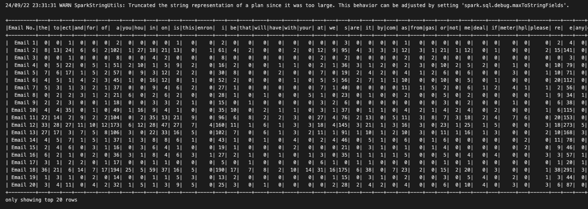
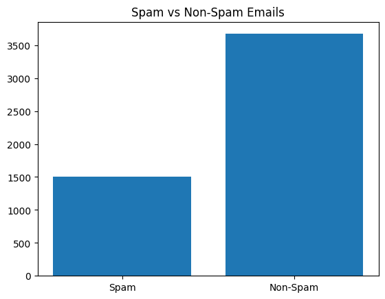
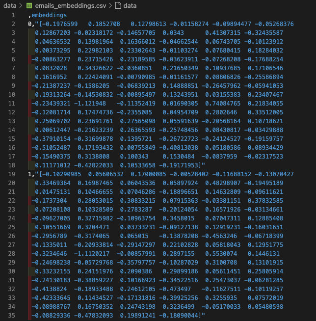
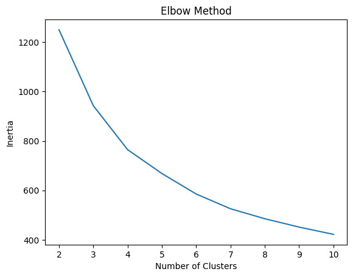
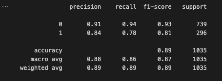

# Email Spam Classification

## Objective

Evaluate clustering, embeddings, and general model training knowledge on text data.

## Installation

```bash
pip install -r requirements.txt
```

## Steps

### Data Preparation

Use the Kaggle email spam classification dataset.



### Pre-process the dataset



- Clean and tokenize the text by removing punctuation, stop words, and numbers using NLTK
- Convert the most common words for each email into embeddings using any standard method using pre-trained embeddings of Genism



### Clustering

- Use PCA to reduce the dimensionality of the embeddings to 2D and K-means to cluster the emails into spam and non-spam emails.



- As the number of clusters increases, inertia decreases because more clusters generally result in tighter groups. In this case, the elbow appears around 4 or 5 clusters, suggesting that adding more clusters beyond this point offers diminishing returns in improving clustering quality.

### Classification

- Train XGBoost model to classify spam and non-spam emails.



### Insights

Identify the top common words that appear in both spam and regular emails using WordCloud.

I am encountering an issue with counting the words in spam and non-spam emails. The code raises an error, and I am unable to resolve it.

## Improvements

- Use different embeddings and clustering algorithms to improve the model's performance.
- Build a pipeline to automate the process of data preparation, pre-processing, clustering, and classification.
- Build APIs to serve the model for real-time predictions.
